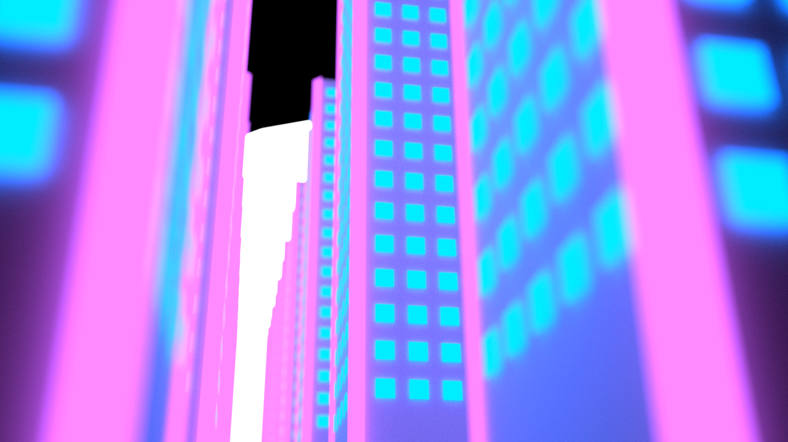
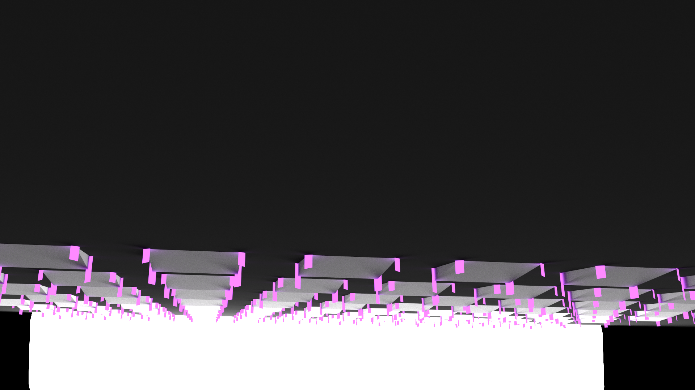
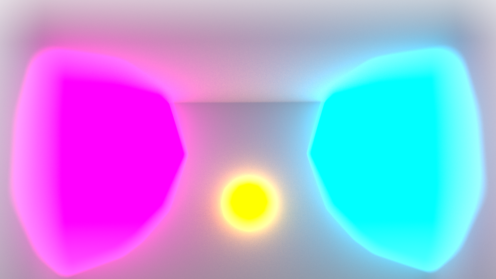

# rendersketchgame #

I'm a fan of Ryan Green's render sketch game, gesture drawing for 3D modeling:

> Hey Twitter, let's play a game. Rules: 10 min timer. 3d Tool. Start with Cube and Plane. Make something pretty. [#RenderSketchGame](https://twitter.com/search?q=%23RenderSketchGame&amp;src=hash) 

> Post your source, remix, share.

> —Ryan [@ryangreen8](https://twitter.com/ryangreen8) on [May 9, 2014](https://twitter.com/ryangreen8/statuses/464796635424641024)

## 06/14/2014: MoonLine ##

First attempt at #rendersketchgame.  The "intended" render sandwiched between two accidents:

## 06/19/2014: Diorama ##

## 06/21/2014: Eafus ##

This one I forgot to time.  It ran a bit over and is "cheating" since it used some [python scripts](https://github.com/mikewesthad/Extract_EverythingAddedToFood_Database) I had written to generate food labels.  Uses the "Everything Added to Food in the United States" database to fill a texture with random FDA-approved food additives.

