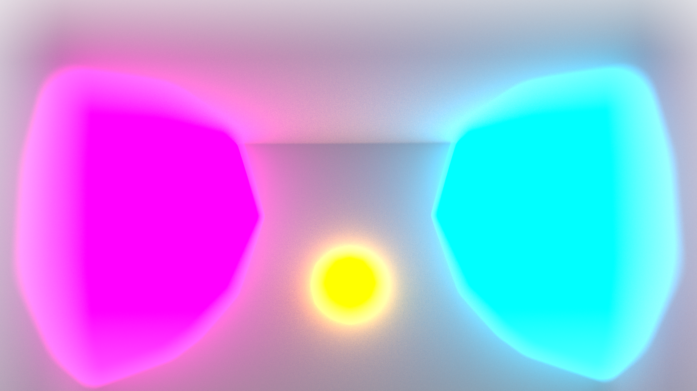
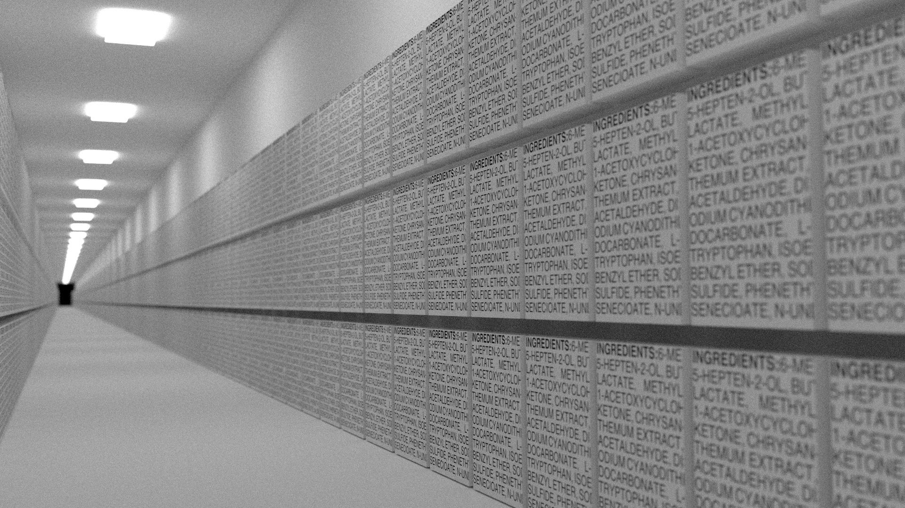
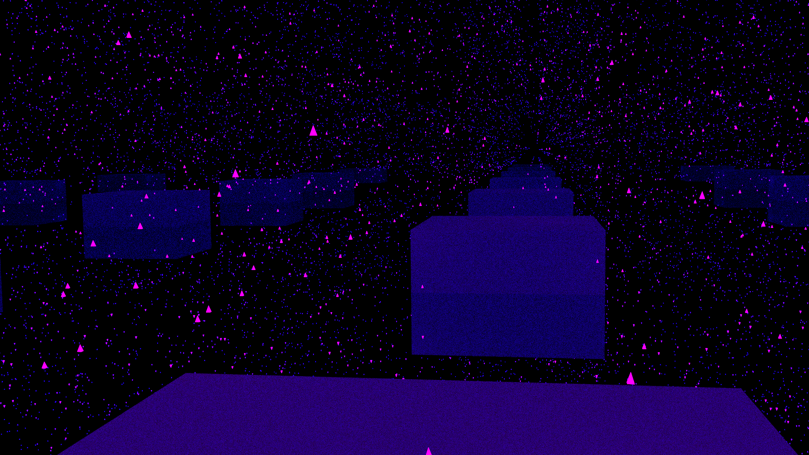
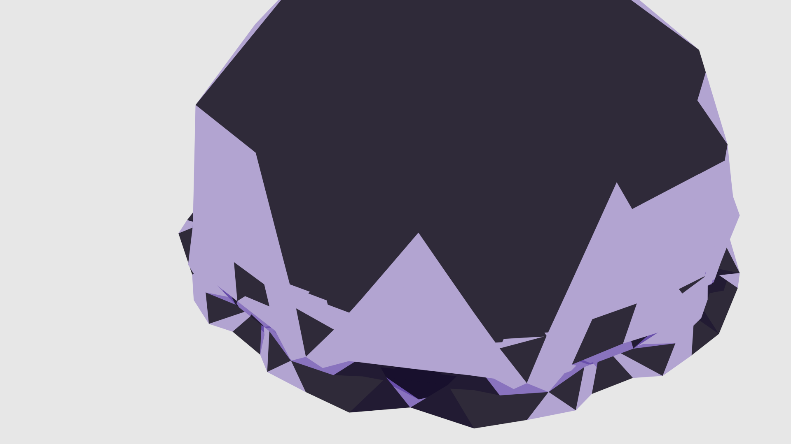
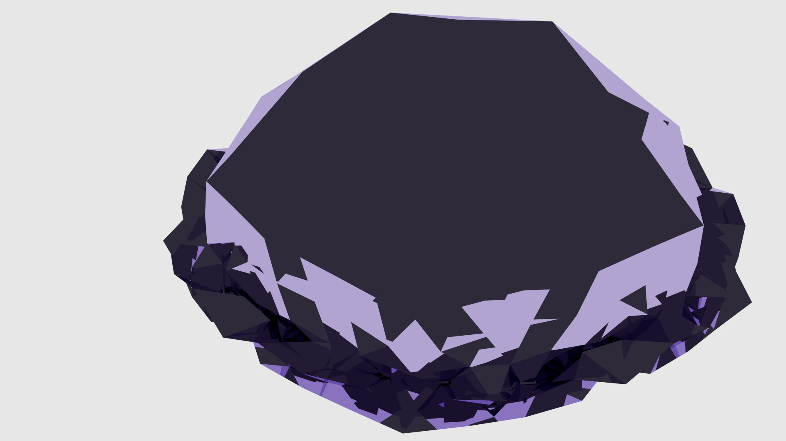
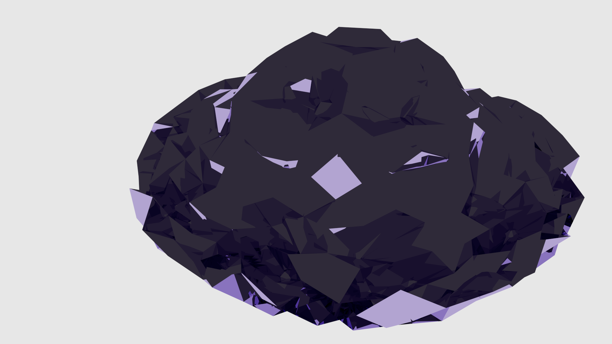
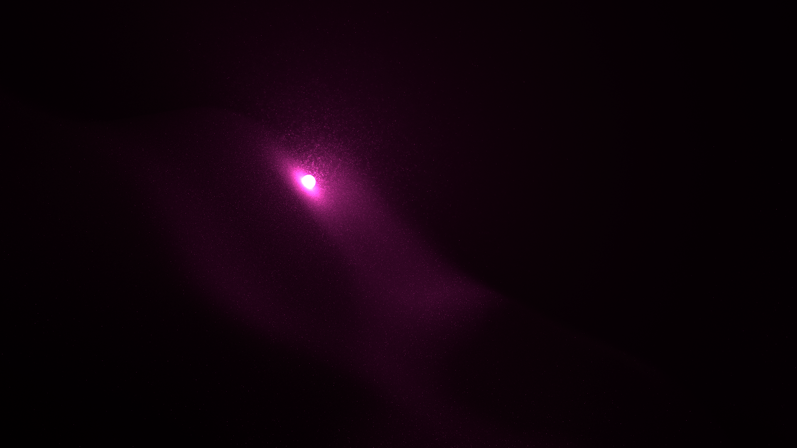
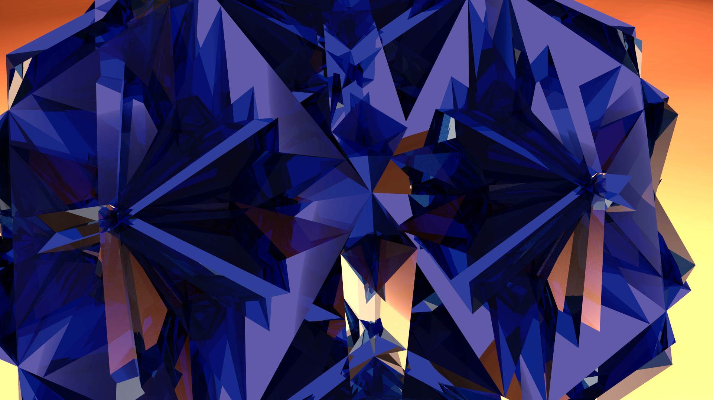

# rendersketching #

I'm a fan of the render sketch game [tumblr](http://rendersketchgame.tumblr.com/) - "10 minute" gesture drawing for 3D modeling.

So, this is a repo of [Blender](http://www.blender.org/) sketches in that vein.

## 06/14/2014: MoonLine ##

First attempt at #rendersketchgame.

## 06/19/2014: Diorama ##

## 06/21/2014: Eafus ##

Used some [python scripts](https://github.com/mikewesthad/Extract_EverythingAddedToFood_Database) I had written to generate food labels.  Uses the "Everything Added to Food in the United States" database to fill a texture with random FDA-approved food additives.

## 06/22/2014: Finfinity ##

## 10/15/2014: Softbodies ##

[Vimeo animation](https://vimeo.com/109319201)

## 10/18/2014: Snownight ##

## 10/18/2014: Pollen ##

